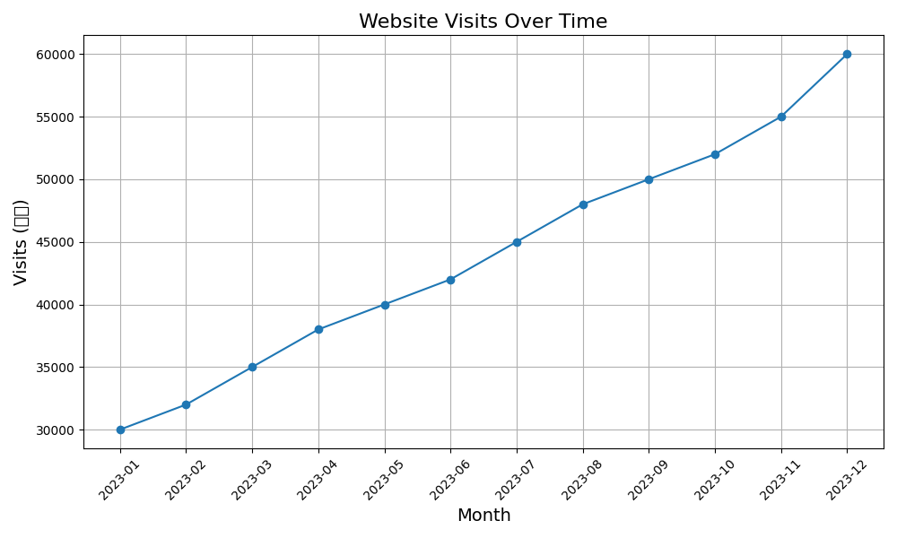

# 电子商务公司销售数据分析报告

## 分析背景

近年来，电子商务行业发展迅速，竞争日越激烈。了解销售业绩及其背后的原因对于制定有效的市场策略越来越重要。本报告通过对过去一年的销售额、访问量和转化率的数据进行分析，查明公司的销售趋势及影响因素，从而为未来的发展提供决策支持。

## 数据汇总

- **时间范围**：2023年1月至2023年12月
- **数据来源**：公司内部销售记录
- **关键指标**：
  - 销售额 (万元)：每月总销售额
  - 访问量 (人次)：每月网站或应用的访客数量
  - 转化率 (%) ：访客转化为实际购买的比例

## 数据可视化

### 销售额随时间变化

### 访问量随时间变化

### 转化率随时间变化

## 具有显著意义的指标

- **销售额增长**：从1月的120万元增长到12月的300万元，增幅达到150%。
- **访问量突破**：11月和12月的访问量分别达到55000和60000人次，比前几个月有明显增长。
- **转化率提升**：转化率从1月的0.4%上升到12月的0.5%，增长了25%。

## 分析建议与结论

- **销售趋势**：销售额整体向上增长，将近年下半年增长更为明显。这可能与促销活动、季节因素或市场推广有关。
- **访问量**：访问量在年底达到高峰，可能与偶季购物季有关。建议进一步分析访问量增加的具体原因，并基此优化营销策略。
- **转化率**：虽然转化率有所提升，但仍有改进空间。可以通过优化用户体验、提高产品吸引力和增加客户信任度来进一步提升转化率。