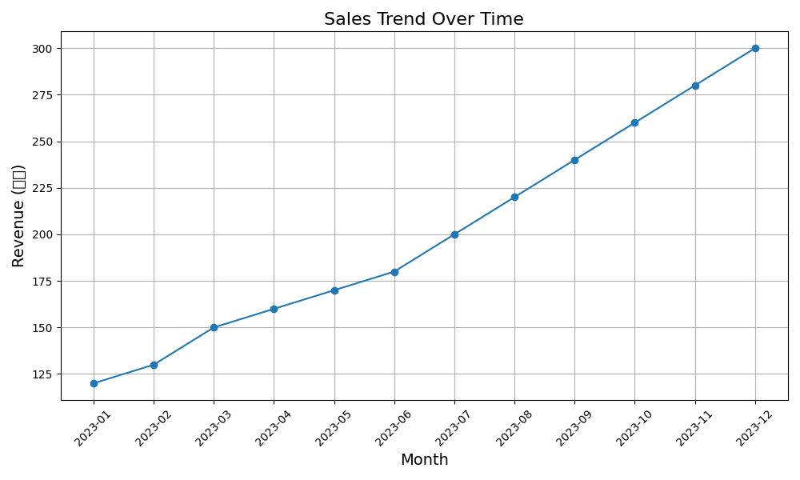
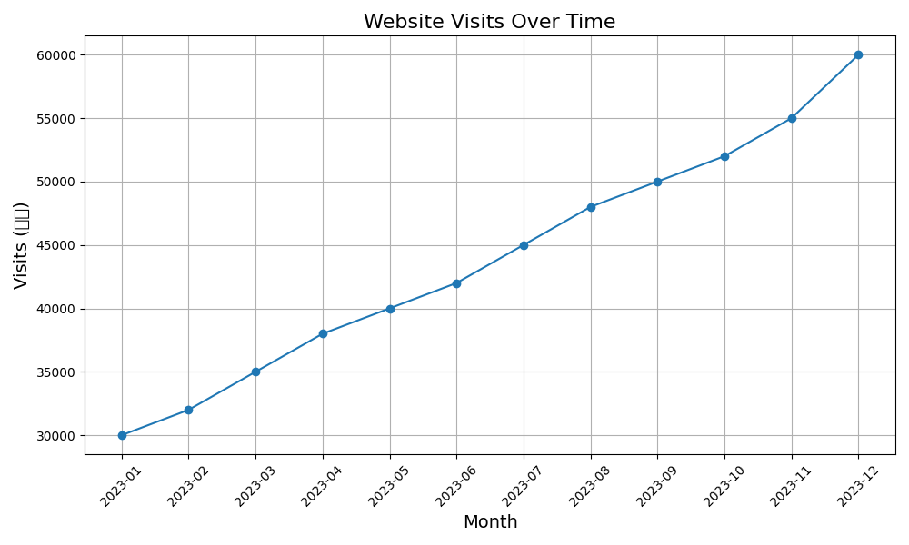
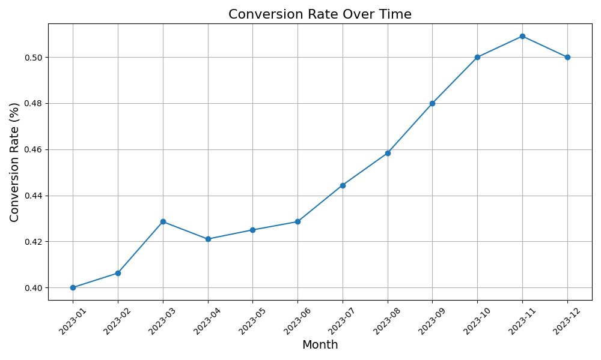

## 数据汇总

- **时间范围**：2023年1月至2023年12月
- **数据来源**：公司内部销售记录
- **关键指标**：
  - 销售额 (万元)：每月总销售额
  - 访问量 (人次)：每月网站或应用的访客数量
  - 转化率 (%) ：访客转化为实际购买的比例

### 数据可视化

#### 销售额随时间变化

#### 访问量随时间变化

#### 转化率随时间变化

### 具有显著意义的指标

- **销售额增长**：从1月的120万元增长到12月的300万元，增幅达到150%。
- **访问量突破**：11月和12月的访问量分别达到55000和60000人次，比前几个月有明显增长。
- **转化率提升**：转化率从1月的0.4%上升到12月的0.5%，增长了25%。